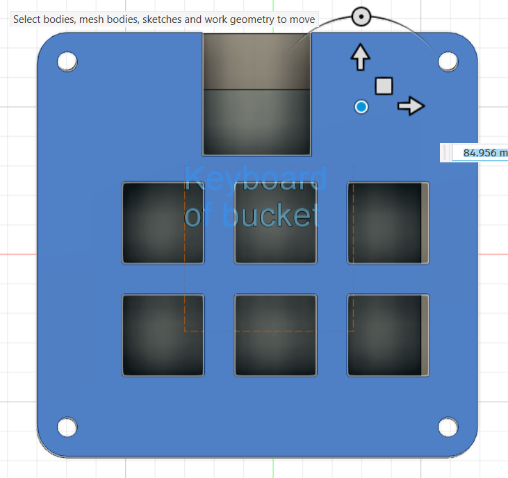
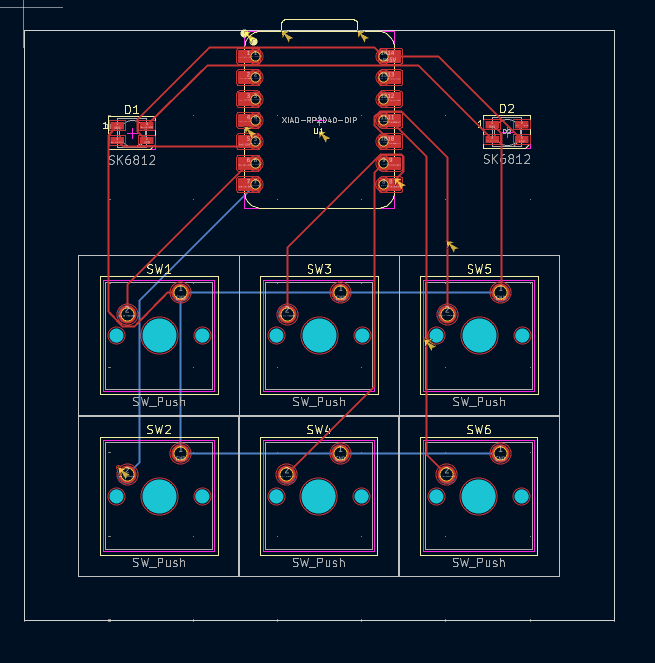

# Bucket's Hackpad: RP2040 Macro Keyboard ⌨️

A custom macro pad project utilizing the Seeed XIAO RP2040 microcontroller for USB input and RGB lighting.

Built as part of [Hack Club](https://hackclub.com)'s Blueprint program.

---

## ✨ Features
*   **Microcontroller:** Seeed XIAO RP2040 (motherboard of the keyboard)
*   **Switches:** MX-Style switches (Note: the project documentation lists 16 components used, despite the description mentioning 6 keys)
*   **Lighting:** SK6812 MINI-E LEDs (RGB lighting for the keyboard)
*   **Design Tools:** Schematic & PCB designed using **KiCad**; Case designed using **Autodesk Fusion**

## 🛠️ Bill of Materials (BOM)
| Item | Quantity | Description |
| :--- | :---: | :--- |
| Seeed XIAO RP2040 | x1 | Main motherboard |
| MX-Style switches | x16 | The keys of the keyboard |
| SK6812 MINI-E LEDs | x2 | RGB lighting |
| M3x16mm screws | x4 | For joining the top and bottom of the case |
| 3D Printed Case | x1 | Custom enclosure |

| Case Enclosure | PCB Layout | Circuit Schematic |
| :---: | :---: | :---: |
|  |  |  |

## 💡 How It Was Made
The project was created by wiring the switches in a matrix and routing the PCB in KiCad. The mechanical enclosure design took some effort to finalize the exact dimensions in Fusion 360.

## 😄 Acknowledgment
*   This project wouldn't have been possible without the documentation from HackClub themselves from https://blueprint.hackclub.com/hackpad
*   My sincere thanks to my elder brother [@P-G-D](https://github.com/P-G-D) for guidance, motivation, and helpful conversations.
